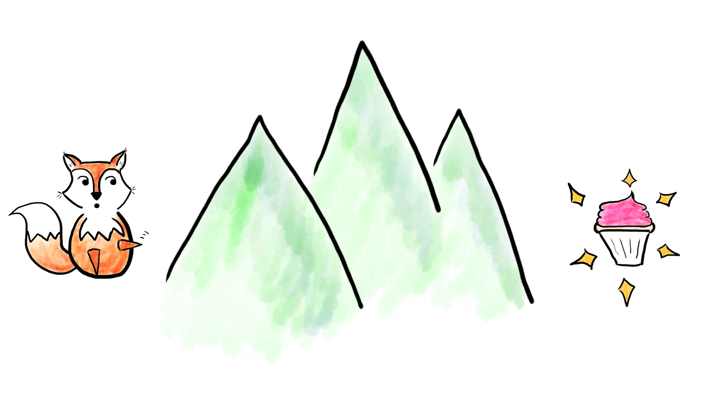
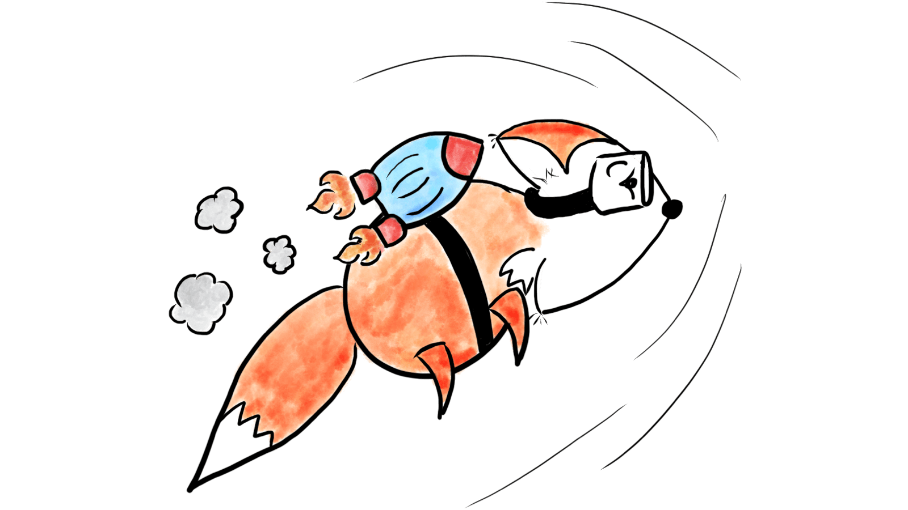

My process is based on a framework that allows me to collaborate closely with my clients while also identifying the areas of biggest impact for their business.

### Goal

Identify the top goals I can help the client accomplish in our project.

### Problem

Discuss potential problems and blockers standing in the way of the goals. I use analytics data and on-the-ground research to identify and validate which problems are stopping the client from achieving their goals.

### Solution

Create an actionable, detailed process for overcoming the problems and achieving the goal.

This process typically involves varying levels of research, working cross-functionally to get all teams on board, and executing the solutions we’ve agreed on to reach those goals.
