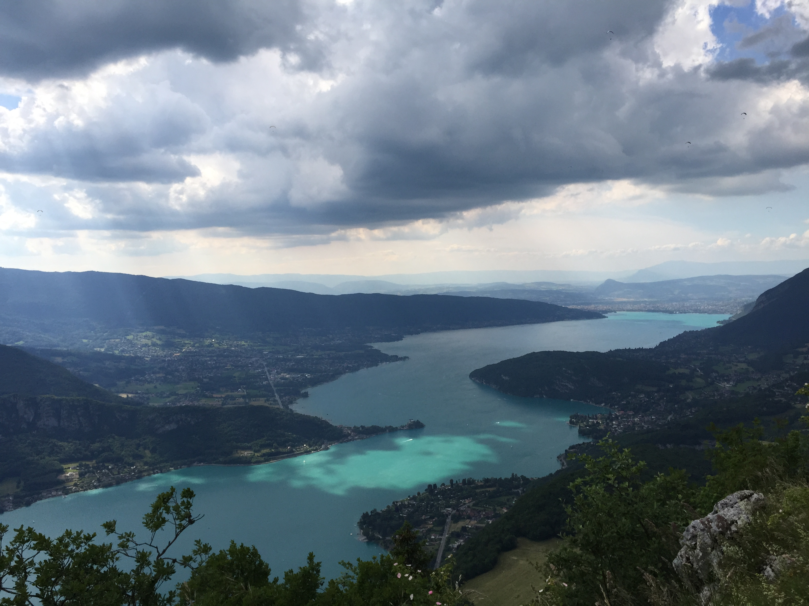
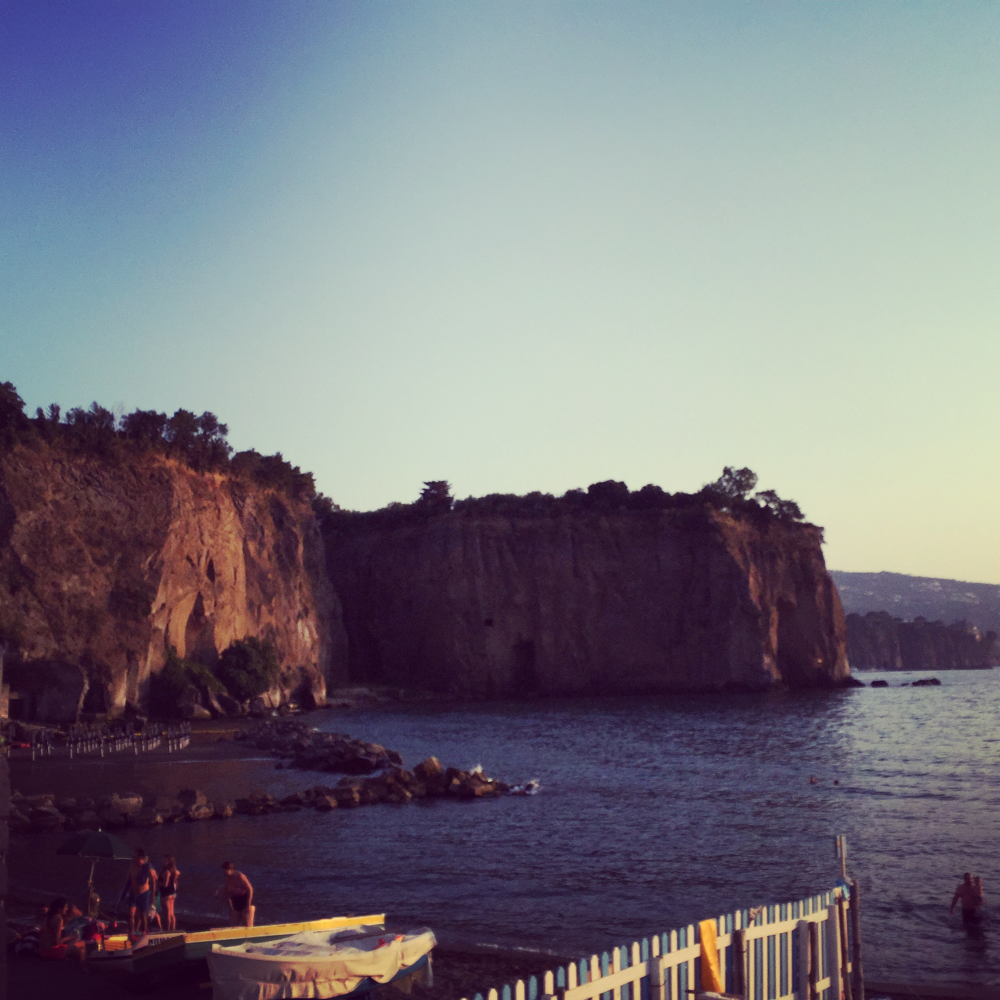
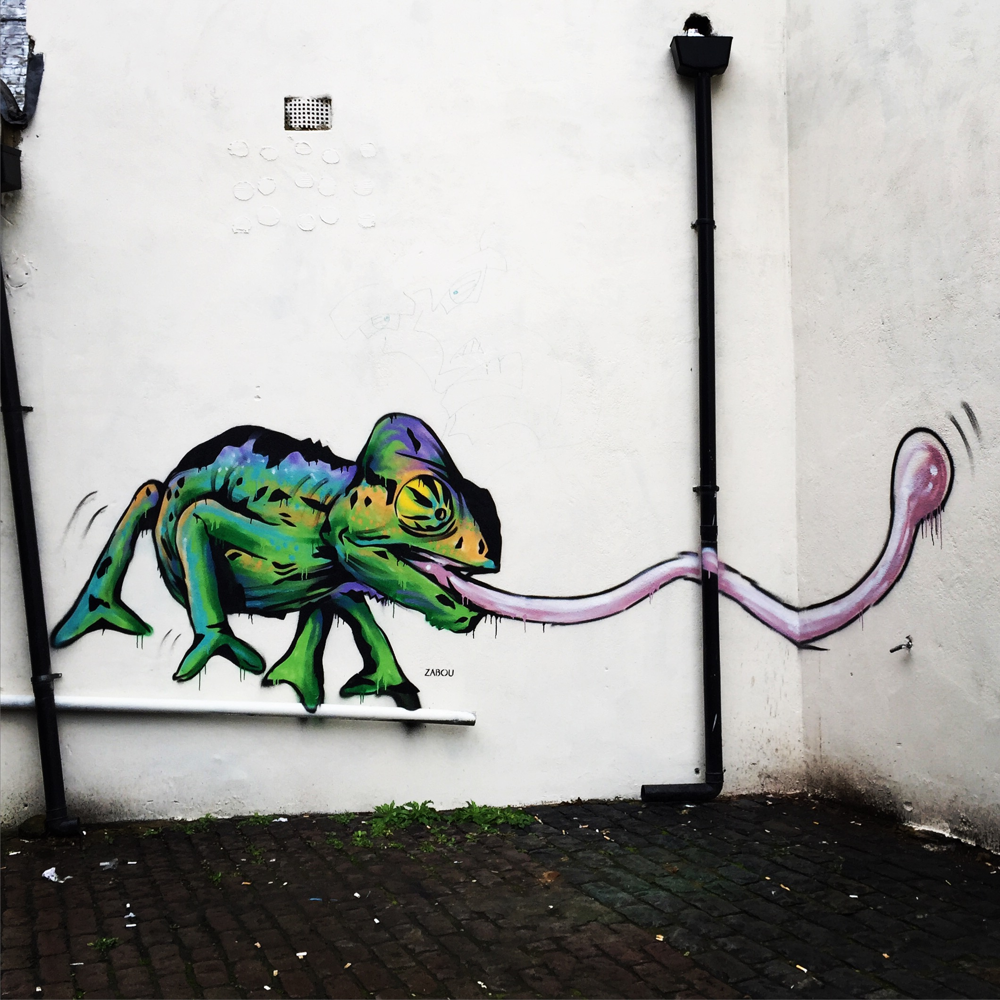
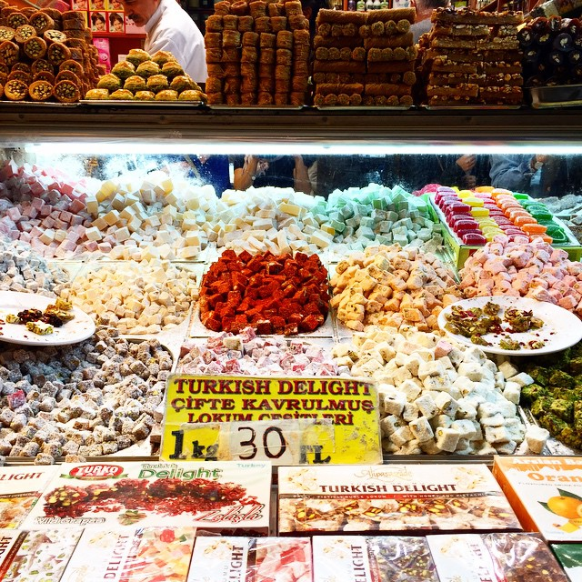
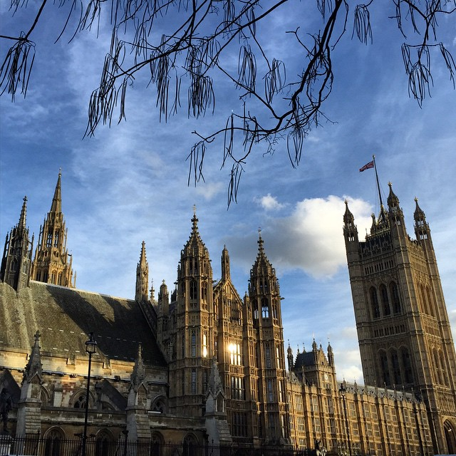
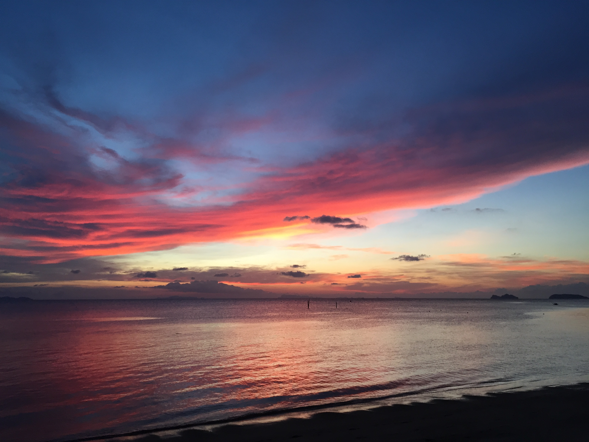

I've been on the road for almost a year now, and the holidays are here, so I'm feeling a bit introspective.

At my birthday and at the end of the year, I like to go over what's happened in the last 12 months, and take a long look at my life.

I ask myself: Where am I now in relation to where I was a year ago? Am I still happy? Am I still actively working toward my goals? Am I doing work I enjoy? Am I trying to be a little bit better every day?

Questions like that help me get a read on myself. It's like doing annual systems maintenance for my brain.

So now that the end of the year is creeping up, I thought it was a great time for my check-in.

After visiting 9 countries and 3 continents, these are the things I've discovered:

**1. People are generally good.** At one point in Spain, my wallet was stolen while we were eating at a restaurant. But the nice waitresses there were watching the guy that did it, and cornered him before he took off with my money. One waitress damn near reached into his pocket to get the last of my euros back. After the whole ridiculous scene played out, the owner, who had been sitting next to us the whole time, gave us free Cava and told us jokes. It was such a surprising turn of events, and reminded me that people care about one another, and do want to make sure that you're okay, even when you're in a big city where you can't even speak the language properly.

<figure class="figure figure--center">
  
  <figcaption class="figure__caption">
    View over the Annecy Lake in France
    <small class="figure__attribution">
      Credit: 
      
        Marisa Morby
      
    </small>
  </figcaption>
</figure>

**2. Bugs aren't a big deal.** I am not a fan of bugs. I don't think anyone is, really.[^1] But in traveling to Thailand, we eat most of our food from the street carts, and of course eat it outside. There are bugs everywhere. Sometimes those bugs decide they want to share some of your food and will hover around, and then just dive in. A year ago, I would have been disgusted, and pushed my plate away, leaving the food uneaten. Now, I admonish that little sucker, pull him out of my curry, and finish my food. Because he's an asshole and I'm hungry.

[^1]:
  Although I know one guy who is an entomologist and on hikes he will see beetles and exclaim, “Oh cute!” which I feel is just the wrong reaction to any bug, anywhere.

**3. A smile can go a long way.** Here in Thailand, we only speak a few words of Thai[^2]. And, of course, I can only understand a few words.[^3] But I always start a conversation with a big smile and say "Sawasdee Ka", which means hello, and even though we are just tourists in their country, they hopefully aren't too annoyed by us. And even if they are, they at least smile back, so everyone feels good.

[^2]:
  And I’m pretty sure that I’m saying a lot of those words wrong. Thai is a tonal language, and so they of course can hear the difference between the length of an “a” at the end of the word, but my Western ears cannot. But… I can order almost every food I like in Thai, so that’s pretty cool.

[^3]:
  I even conducted an entire food transaction in Thai a few nights ago. The chef asked me if I wanted “kao” with my food. I knew immediately that he meant rice, without having to even think about it. _Very_ exciting. It’s the little things, you know?

In each country we visit, we learn how to say hello, goodbye, thank you, and I'm famished (just kidding — kind of). And people from each country are so appreciative of the effort. In France, they want you to stop butchering their language with your bad accent, so they either try to teach you or just speak in English. In Spain they will work through the Spanish with you. In Turkey they just seem generally delighted that you're ordering in Turkish. It's a great way to try and connect with people who you can't have a full conversation with.

<figure class="figure figure--center">
  
  <figcaption class="figure__caption">
    Sorrento, Italy
    <small class="figure__attribution">
      Credit: 
      
        Marisa Morby
      
    </small>
  </figcaption>
</figure>

**4. The world runs on empathy.** In every place we've been, except London and Canada, the main language hasn't been English. We've brushed up on our Spanish, muddled our way through French, stared in confusion at Croatian, mumbled Turkish[^4], and tried desperately to repeat Italian. But the one thing that seems to translate in every place we've been is empathy. We know that the person we're trying to talk to is frustrated because we're saying words that make no sense. And they know that we're frustrated that no one understands us. That mutual understanding makes people surprisingly patient. People will take the time to help us with our question. Sometimes they'll even teach us how to say the phrase correctly, so that we can use the right words in the future.

[^4]:
  This went surprisingly well by the way. Turkish is an absolutely fascinating language. First, because it’s spelled completely phoenetically, so even if you have no clue what the word is, you can easily read it. Second, this language has a good amount of mumble to it. So people actually understand you when you mumble. It’s really quite cool. I’ll show you. This is the street we stayed on: Fındıklı. The characters that look like dotless “i’s” make an “uh” sound. Say it out loud. Sounds like “Fuhnduhkluh”. “See? Totally phoenetic!

**5. You learn how easy it is to make friends.** Back in the states, I have my specific set of friends. I know who I'm going to hang out with and I meet new people every once in a while, but I don't put tons of effort into this, since I've already got my core group. Traveling, though, makes it easy to talk to anyone and everyone because you've already got one thing in common: you're tourists. You're more willing to talk to new people, and if you really hit it off, get their info and follow their travels, too.

<figure class="figure figure--center">
  
  <figcaption class="figure__caption">
    Street art in downtown Shoreditch in London.
    <small class="figure__attribution">
      Credit: 
      
        Marisa Morby
      
    </small>
  </figcaption>
</figure>

**6. You become an accidental expert tour guide.** In Koh Samui we took a Songtew[^5] back to our hotel from the immigration office. We'd been on Koh Samui for almost two months, and when we got into the truck there were two Dutch women and a French couple, all of whom had just gotten in that morning. We spent the trip giving out tips about the area, suggesting tours they could take, and even showing the French couple to our hotel so they could see if they liked it and wanted to book. It felt great to be able to help them and give advice for their stay.

[^5]:
  They have Songtews, taxis, and tuk tuks in Thailand. Songtews usually run on a defined path, kind of like a bus system, and tuk tuks are little scooters with a small covered seat attached that will take you anywhere, just like a taxi, but for a discount.

**7. Patience really is a virtue.** I remember being taught (well, my family attempted to teach me) to be patient as a child. I never really got the hang of it. I was too fidgety, too high-strung, and too anxious. As I've been traveling though, I've mellowed out quite a bit. It's not because I want what I'm waiting for any less. But, I've gotten tired of feeling so tightly wound all the time. There's no point in wasting all that energy on something I'm not in control of. Now I can wait in airport lines without panicking. When we're lost, or can't get our message across to the taxi driver, or the shop we wanted to visit is closed and has no posted opening time, I'm now able to just shrug my shoulders and move on. That level of patience has been hard won, and is totally freeing.

<figure class="figure figure--center">
  
  <figcaption class="figure__caption">
    All the Turkish Delight you can eat from the Spice Bazaar.
    <small class="figure__attribution">
      Credit: 
      
        Marisa Morby
      
    </small>
  </figcaption>
</figure>

**8. Personal space is different.** I've always had a big need for personal space. I think part of this has to do with the fact that I'm really small, and lots of people standing next to me is a really good way to get stepped on.[^6] I also grew up in a relatively small city that was pretty spread out. There was no need for physical closeness. But traveling has gotten ride of all that. In Istanbul, Turkey, there is simply no way to walk through the center of the city and not get touched on all sides. There are just too many people packed into a tiny, tiny space. Now, when I walk down the street, I don't avoid crowds like I used to, getting slightly panicked at the thought of the onslaught of people brushing past me. I don't even notice.

[^6]:
  Unfortunately I’m very well-versed in this. I have been walked on by people who just didn’t bother to look down to see if anyone was there. It doesn’t leave room for options — step out into the street and get hit by a cab, or get stepped on by a tall, oblivious German?

**9. The key to confidence is convincing yourself.** Traveling is a constant test of your confidence. Going into most conversations means a lot of gesturing, pointing, maybe even a bit of miming. But you've got to go into the situation sure that you can get your message across, no matter what. Because confidence has very little to do with convincing others that you're capable — it mostly has to do with convincing yourself. If you believe you can do it, it's easy to bring other people on board with you.

<figure class="figure figure--center">
  
  <figcaption class="figure__caption">
    Golden Hour in the Gothic Quarter in Barcelona, Spain.
    <small class="figure__attribution">
      Credit: 
      <a class="figure__attribution-link" 
         href="">
        Marisa Morby
      </a>
    </small>
  </figcaption>
</figure>

**10. Don't take yourself so seriously.** Traveling humbles you and makes you realize that you don't have to take everything so seriously. You'll probably eat the dish incorrectly and everyone at the restaurant will look at you like you've got four heads. Maybe you'll make the huge cultural mistake of not taking your shoes off at the entrance of the house. You'll do that once, apologize profusely, laugh at your cultural ineptitude, and move on.

**11. I take time to actually see what's going on around me.** Around December 20th of every year, I would say, "Holy shit, where has this year gone? It went by so fast!" I've said this every year since I was 20, and every year I've meant it. I haven't said or even _thought_ it this year. Because this year, I made an effort to slow down and actually see what's happening around me. This year, I don't feel like time pulled a fast one on me and is laughing at me, saying, "Bitch you fell for it _again!_ When are you going to start paying attention?"[^7]

[^7]:
  Clearly, in my head time is an asshole. I have a screwed up relationship with time that I’m focusing on making better.

<figure class="figure figure--center">
  
  <figcaption class="figure__caption">
    Sunset over the ocean in Koh Phangan, Thailand.
    <small class="figure__attribution">
      Credit: 
      
        Marisa Morby
      
    </small>
  </figcaption>
</figure>

## I'm Excited to See What Else I Learn

This year has been a whirlwind of new adventure, excitement, new friends, and dedication to working on things I love. I'm excited to see what other new adventures and countries are waiting for me in 2016.

<figure class="figure figure--center">
  
  <figcaption class="figure__caption">
    Krka, Croatia — one of the loveliest places.
    <small class="figure__attribution">
      Credit: 
      
        Marisa Morby
      
    </small>
  </figcaption>
</figure>
