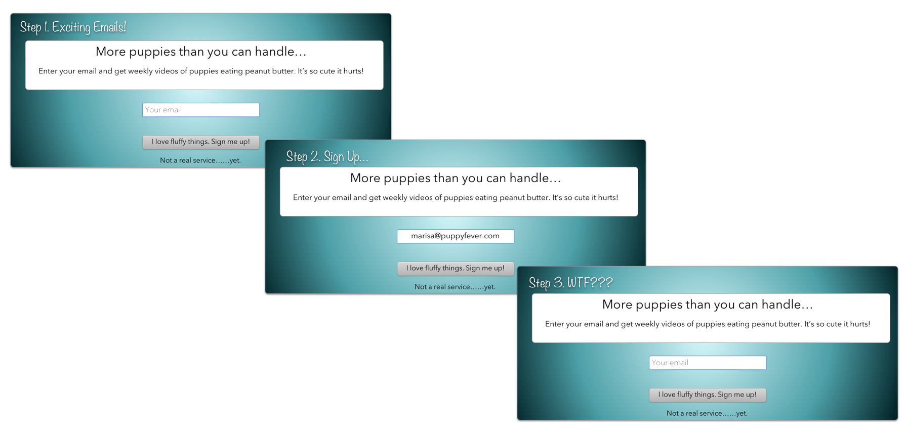

So, I'm trying to grow my email list. Which, for me, is a lot like the hell that Sisyphus was forced to live. If you don't know who that is, here's a quick little animation for you. Sisyphus, the eternally punished, got to roll this boulder up a hill, get it to _almost_ the tippy top, only to lose his footing and watch it roll back down again. Every. Single. Fucking. Day.[^buff]

[^buff]:
  On the plus side, he's getting a full body workout, so he's looking pretty buff.

_This_ is what growing my email list feels like. More or less.

<iframe src="https://www.youtube.com/embed/QcmJlXeyGxU?start=32&amp;end=45" width="420" height="315" frameborder="0" allowfullscreen="allowfullscreen"></iframe>

And for all of you working on this, too, I know you get pretty excited at the prospect of someone on the other side of the computer, looking at your site in wonder, and clicking the "Sign Me Up" button.[^creepy]

[^creepy]:
  I will not lie, on days when I'm doing heavy business reading, I've dreamt of this person on the other side of the world, clicking the "Sign Me Up" button. Yes, I know it's weird. Yes, it's also sort of creepy. But I own it so that makes it a little better, right? Right??

These past few months I've been learning as much as I can about running a business and running a site, so I thought I'd pose this question to all of you:

What happens after someone signs up on your site?

Is it this?

<figure class="figure figure--center figure--no-border">
  
  <figcaption class="figure__caption">
    <small class="figure__attribution">
      Credit: 
      
        Marisa Morby
      
    </small>
  </figcaption>
</figure>

Yes. I realize that this is the same sign up screen that you would have just completed.

When we're creating a site, we (hopefully) spend a lot of time getting the copy right, getting the images the way we want them, and making the thing mobile friendly.

But sometimes we forget the simplest things that aren't immediately noticeable on the site. Like thank you pages. Error pages. Submit messages.

They seem small, but what happens if we don't include these?

Imagine you're talking to someone on the phone. You say, "Yeah, I think we should do that." And then silence. That's all. Just long, slow, confusing silence.

When you don't have status updates on your site, you're basically ghosting on the people you're trying to talk to. They've said something to you and you're responding with... nothing.

And they wonder:

- "Did it work?"
- "When will I hear back?"
- "What do I need to do now?"

So go through your site and check for these things. Can you successfully get through an entire email sign up and know the entire time what's going on and what's expected of you?

If there are any gaps, fill them in, and if you're not sure, send your site to a few people and ask them to go through the main interactions on your site. If they can't do it, or get confused, fix it.

And then congratulate yourself because you just did your first usability test!

Remember that your site is having a conversation with the person on the other side of the screen. It's interactive. Make sure you're not leaving the other person hanging.

## What to read next

- [Two Changes You Can Make for Better Facebook Marketing](/better-facebook-marketing/)
- [4 Ways to Make Your Business Stand Out and Get Noticed](/get-noticed/)
