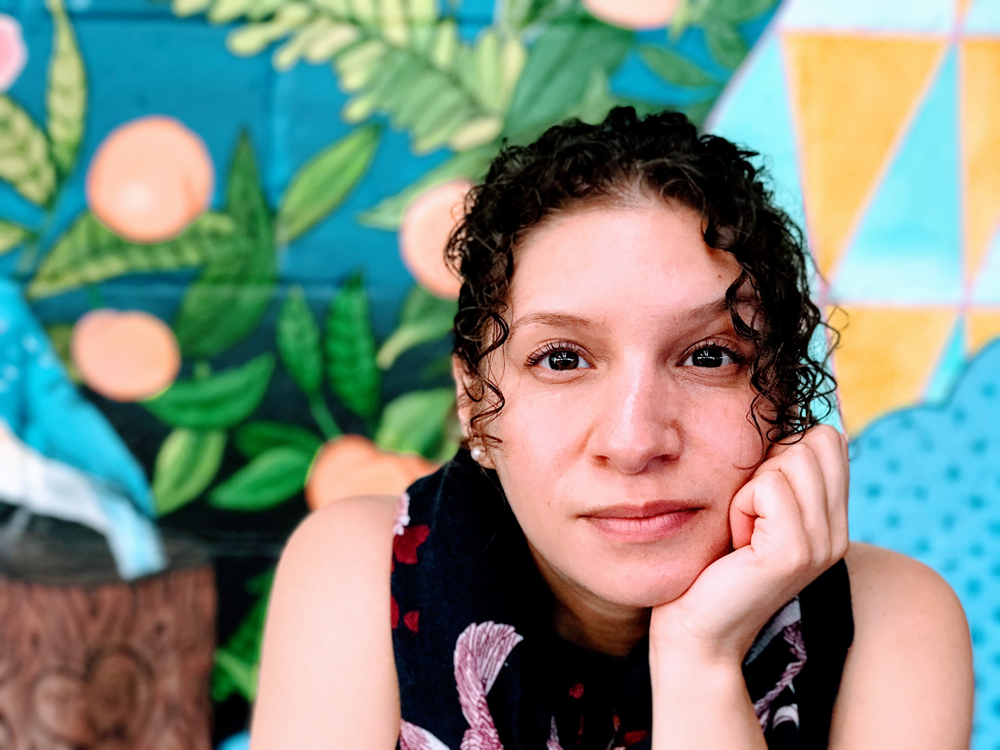

import Button from '../src/components/button';

export const slug = 'about';

# Hello. I’m _Marisa_.

**I do UX Design, Research, and Product Strategy.** I focus my work on new technologies, reducing climate impact, and urban planning.

<Button to="/#contact" centered>
 Contact Me
</Button>

### My Mission

In many cases, I think the biggest impact we can make is through focused, incremental change — like an ocean tide rolling over the sand that slowly changes an entire landscape. I believe thoughtful research and design can have a huge and long-lasting positive impact. I do my best to focus on projects and ideas that make us kinder as people, healthier as a planet, and happier with ourselves.

### I’ve researched and designed processes and products

- Conducted research studies for product creation, product design, and conversion optimization
- Designed customer journeys, wireframes, and product prototypes
- Led research and design workshops to help cross-functional teams collaborate

In each of these projects, I have made clients hundreds of thousands to millions of dollars in additional revenue through A/B testing, research, and design changes and adoption. And through research I've helped teams identify their audience and find product-market fit.

### My Superpowers

- I combine the best ideas from broad areas of study, including behavioral psychology, natural systems, and business, to discover not just _what_ is happening, but _why_ it’s happening, so we can confidently define what we need to learn and how to get there
- I’m a master of identifying the highest-impact problems and working on cross-functional teams toward solutions that get great results

### I love writing about what I’ve learned

I write about design, research, projects, and skills that I’ve gained over the years in an effort to help teach others. [See my writing here.](/articles)
